# Conductore

Drive Claude Code, Herdr and tmux sessions on your own machines from your phone or desktop, over SSH or Mosh, with no relay server and no account.

[](LICENSE)

[](../../releases)

Conductore runs on Android, iOS, Linux, Windows and macOS from one Flutter
code base, and on desktops and tablets it opens a sidebar and split-pane
shell. It is a fork of
[Conduit](https://github.com/gwitko/Conduit) by gwitko.

<table>
  <tr>
    <td align="center">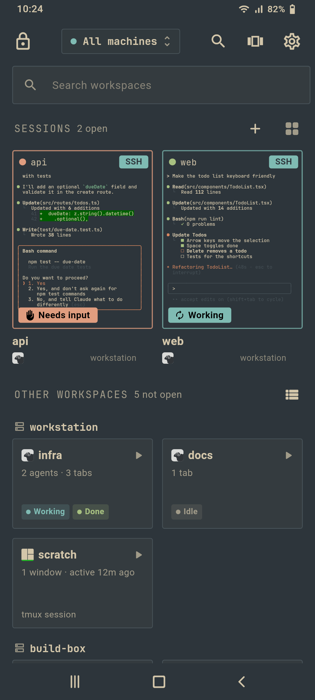<br><sub>Home: live sessions and other workspaces</sub></td>
    <td align="center">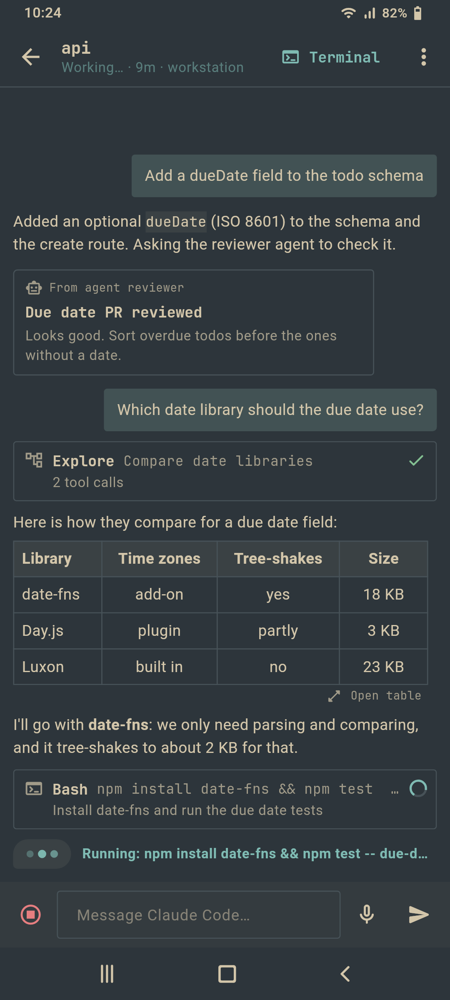<br><sub>Chat View while Claude works</sub></td>
    <td align="center"><br><sub>Quick switcher</sub></td>
    <td align="center"><br><sub>Terminal on a Herdr session</sub></td>
  </tr>
</table>

<p align="center">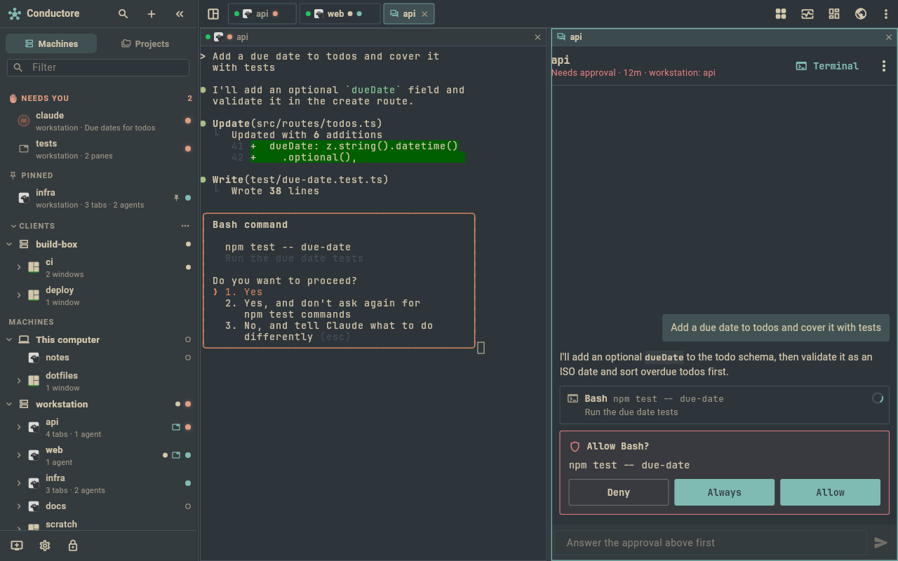<br><sub>The desktop shell: sidebar, a terminal and Chat View in two splits</sub></p>

More in [Screenshots](#screenshots). Jump to [Install](#install).

## Why

- **Your machines, your keys.** Hosts, keys and trusted fingerprints stay on
  your devices. No account, no cloud, no subscription.
- **No relay.** The app connects straight to your machines over SSH or Mosh,
  usually through Tailscale. Nothing sits in the middle and nothing on the host
  listens on a new port. Device sync goes through one of your own machines.
- **Agents first.** The app is built around watching and steering coding agents
  (Claude Code) inside Herdr and tmux, not around a generic terminal.

## What's new

Previews 29 to 31 (companion 1.8.0 bundled):

- **Preview 31**
  - A tab whose Herdr workspace was closed says so, with **Keep what Herdr
    shows** and **Close tab**, instead of silently following another
    workspace. Chat View from such a tab opens the agent on screen.
  - Project rows lead with the agent's own title and show the pane's
    sidebar text, with a three-dots menu on editable group headers.
- **Preview 30**
  - **Prompts wait for you for 15 minutes** (companion setting
    `permission-wait`, 1 to 60). Answering in the terminal ends the wait at
    once; after it runs out, the card stays and your answer is typed into
    Claude Code's own dialog.
  - **Sync with sheprd v2**: layout edits made in the app (move to a project
    or Other, hide, projects, rules, order, remove from active) go back to
    sheprd, shown as pending until sheprd confirms. Needs sheprd 0.9.3-20 or
    newer.
  - **Swipe back** from the left edge on phones (predictive back on
    Android), the mouse back button and Alt+Left on desktop.
  - Each Claude account shows once in Usage, even when two machines name it
    differently; each half of a Herdr split opens on its own pane.
- **Preview 29**: lower battery, network and CPU use in the background
  (polling backs off, SSH keepalives, the screen stays on only for a
  terminal in front); approvals fail safe (a command the companion cannot
  fully read is high risk and never auto-approved, plans are never trusted);
  started tasks clean up their agents and branches.

Older previews, one line each (full notes are on the
[Releases](../../releases) page):

- **28**: the markdown task folder can hold several projects, with a Project filter.
- **27**: honours sheprd's "removed from active" flag.
- **26**: Sync with sheprd (marks and layout, read from its shared view), a more compact usage card, a details provider for the Outsmartis launcher.
- **25**: start one or many tasks as agents, each in its own worktree and branch.
- **24**: Tasks from GitHub, GitLab, Jira, Linear, Trello, ClickUp, Asana, Notion or a markdown folder; Gemini CLI and Cursor agents.
- **23**: Codex and OpenCode agents next to Claude Code; usage follows the account in use.
- **22**: project-grouped views shared with sheprd's sidebar, search across every machine from the home, create a Herdr workspace or tmux session from New session.
- **21**: usage lists a Claude login that cswap does not manage; crisper terminal cells.
- **20**: Herdr clicks on another workspace are dropped, not typed.
- **19**: live Herdr and tmux state, agent-to-agent messages, Talkbawt hand-offs, continue on the other device.
- **18**: desktop polish (command palette, layouts, dialogs, right-click menus, quick actions) and one summary notification per agent.
- **17**: Review mode and undo, usage explorer, Chat View message menu and find, Android widget.
- **16**: agents dashboard, pending bubbles for sent messages, one default view everywhere.
- **15**: smart approvals and the voice guide.
- **14**: desktop shell.
- **13**: Settings screen, *This computer*, Herdr and tmux tabs.
- **12**: desktop builds, quick switcher, voice, Chat View, device sync, live preview.

## Features

### Agents

- **Chat View** for Claude Code sessions: read the conversation as chat and
  reply from a composer, instead of reading the raw TUI.
  - A live working indicator says what Claude is doing and for how long.
  - Markdown tables render as tables, scrollable and full screen.
  - Messages from other agents and Claude sessions, task notices, shell and
    slash commands each get their own card, never shown as yours; a
    teammate that finished gets one "*X* finished" row.
  - Scrolled up, the thread stays still. New messages wait behind a pill.
  - What you send shows at once as a pending bubble.
  - Long-press a message to copy, share, quote it or send it to another
    agent; find in the conversation with Ctrl+F (Cmd+F).
- **Voice** (Android and iPhone): read Claude's final answer aloud, and
  hands-free **Talk mode** that listens, sends after a pause, reads the
  answer and answers approvals by voice. Dictation keeps listening across
  pauses. The mic and Talk are in Chat View whichever way you open it.
- **Voice guide**: talk to the whole app hands-free: ask what is waiting,
  open an agent, approve, read a reply or switch accounts. Common phrases
  work offline in English and Portuguese, the rest goes to Claude through
  the companion (0.8). It confirms aloud before it acts, always for high
  risk.
- **Read-aloud length** (Brief, Full or a Claude summary) and **tool
  activity** in Chat View (Show all, Collapsed or Hidden), from the header
  menu or Settings.
- **Agents dashboard**: since your last look, each agent's facts (files,
  lines, tests, failed commands, tokens and cost), stuck flags, and a Claude
  summary made only when you open it (companion 0.9).
- **Review mode and undo** (companion 1.0): every turn is snapshotted;
  review it file by file, reject one file, send feedback, or undo the turn.
- **Other agents**: Codex and OpenCode work like Claude Code (dashboard,
  notifications, Chat View, approvals from the phone, usage); Gemini CLI and
  Cursor CLI are watched, and a request they raise says *Answer it in the
  terminal*. Each is named as itself in chat, approvals and notifications.
- **Message agents** from Chat View: send to one or several, ask and wait for
  the answer, and relay it back.
- **Inbox** of every agent across your machines, with permission requests you
  answer with Allow, Deny or Always, and a Usage tab. A prompt or question
  waits for you for 15 minutes (companion setting `permission-wait`); if
  you answer in the terminal the wait ends, and after it runs out the card
  stays and your answer is typed into Claude Code's own dialog.
- **Smarter approvals** (companion with `smart-approvals`): every request
  carries a Low, Medium or High risk label with a one-line reason. "Trust…"
  allows a pattern such as `Bash(npm test *)` for 15 min, 1 h or until the
  session ends, in one session, one repo or all repos; "Always" saves the
  same kind of rule until revoked. The companion answers matching requests by
  itself, even with the phone offline, and never answers a high-risk one.
  "Approve all N safe" clears the low-risk ones in one go, the inbox lists
  what was auto-approved in the last 24 h with "Undo trust", and Settings ›
  Agents › Approval rules lists and edits each machine's rules.
- **Usage** (companion 0.6 or newer): Claude's 5-hour and weekly limits,
  tokens and an estimated cost per day, machine, project and model, Codex
  too. On the home screen, the widget and the Quick Settings tile, with an
  optional alert at 80% of the 5-hour window. The usage explorer (companion
  1.0) shows any range, a day by the hour, filters and a CSV export. With
  [cswap](https://github.com/realiti4/claude-swap) on the machine
  (companion 0.8), every Claude account's limits, and a confirmed switch.
- **Notifications with actions**: by default one silent, ongoing notification
  lists every agent's progress ("web · Working · Bash"), and separate alerts
  come only for urgent things: a permission request, a question, an error, an
  agent that looks stuck, and finished turns if you opt in. Allow or Deny a
  low-risk request, pick an answer to a short question, Reply to the agent,
  or jump to its exact pane, straight from the notification; acting from the
  lock screen asks you to unlock first. Each agent has one alert that sounds
  once, goes away once it is resolved, and can be muted with a long-press.
  "Everything" brings back one notification per agent for every need. See
  [docs/notifications.md](docs/notifications.md).
- **Home screen widget and Quick Settings tile** (Android) showing the
  dashboard: agents that need you or are stuck, and the limit rings.
- **Tasks**: one list across your trackers (GitHub Issues and Projects,
  GitLab, Jira Cloud and Server, Linear, Trello, ClickUp, Asana, Notion, or a
  folder of markdown files on a machine). **Start** a task, or several, as
  agents: each gets its own git worktree, branch and agent in a Herdr tab or
  tmux window, with attempts, a cap and optional "mark done". Finished runs
  keep their agent open for review and then clean up
  ([docs/task-sources.md](docs/task-sources.md),
  [docs/task-runs.md](docs/task-runs.md)).
- **Talkbawt hand-offs**: hand a piece of work to another person's agent
  through a shared link, and read or answer links sent to you.

Most of this needs the [host companion](#host-companion) on the machine.

### Sessions, Herdr and tmux

Both multiplexers are first-class: everything below works for Herdr and for
tmux.

- **Home screen built around your servers**: pick one, several or all machines;
  your open sessions show as live previews (grid, large tiles or a list) with
  Mosh/SSH badges and each agent's state, and **Other workspaces** lists the
  Herdr workspaces and tmux sessions you have not opened yet.
- **Quick switcher**: agents waiting on you, open sessions with live
  thumbnails, other workspaces and recents, with search across every
  machine. Swipe the top row
  or press Ctrl+Shift+K (Cmd+K on macOS).
- **Chat View or Terminal by default**: choose how Claude sessions open, per
  session or for all.
- **Session restore**: open sessions come back after an app restart and
  reconnect by themselves ([docs/session-restore.md](docs/session-restore.md)).
- **Several sessions on one Herdr server**: Herdr shares one focus between
  all its screens, the laptop included. By default the app never moves it:
  composer and snippet text goes to each session's own pane, typed keys
  wait while Herdr shows another workspace, and tiles read their own
  workspace. *Phone may move Herdr focus* lets the session in use take it
  instead ([docs/herdr-shared-focus.md](docs/herdr-shared-focus.md)). A tab whose
  workspace was closed in Herdr says so and offers *Keep what Herdr shows* or
  *Close tab*.
- **Projects and sheprd**: workspaces and agents group by project, read from
  sheprd's `sidebar.toml` and shared
  across your devices. With **Sync with sheprd** on, sheprd's shared view
  gives the layout and each agent's unread, kept and dismissed marks, and your
  edits (move, hide, projects, rules, order, remove from active) go back to
  sheprd ([docs/sheprd-view-sync.md](docs/sheprd-view-sync.md)).
- **Navigators** for Herdr and tmux: every pane with its agent and state, tap to
  switch, one-tap **Split right / Split down / New tab / New workspace** (tmux:
  new window), windows or tabs 1-9, zoom, kill pane and detach. Long-press the
  toolbar's Herdr or tmux button for the split menu.
- **Back**: swipe right from the left edge of any page on a phone (predictive
  back on Android), or the mouse back button and Alt+Left on a desktop.
- **Gestures**: swipe for tabs or windows, two fingers sideways for panes, two
  fingers up/down for workspaces (Herdr) or scrollback (tmux), pinch for the
  font size. Every mapping is configurable.
- **Deep links** from notifications, the home screen and the inbox open an
  agent at its exact workspace, tab and pane, in Herdr or tmux.
- **The host's own keybindings**: Herdr keys are read from the machine's
  `~/.config/herdr/config.toml`, falling back to Herdr's defaults.
- **Configurable multiplexer prefix**, including Ctrl+Space.
- Official tmux and Herdr logos, per-host tmux auto attach/create, start
  directory and scrollback mode.

### Terminal

- **Compact pill toolbar**: Ctrl, Esc, Tab, Herdr, Paste and Chat, then ⋯
  for the full key rows (Chat, arrows, function keys, ^L to redraw, Snip,
  fullscreen and your own key combos). Long-press the pill to add, remove
  or reorder buttons; a list or rows you customized are kept as they are.
- **Snip** opens the prompt palette: /clear, /compact, continue, Esc Esc and
  the other quick prompts, then the machine's and your global snippets.
- **Chat button** (on the pill and in the key rows): opens Chat View when an
  agent runs in the session, and the chat line otherwise. Long-press it for
  the chat line. The chat line's
  mic dictates, and its expand arrow opens the full prompt composer.
- **One ⋮ menu** for what has no button of its own: quick actions (when the
  session's project has some), git diff, live preview, Reconnect, new
  session, Settings and Close session; recent folders and keyboard
  shortcuts on desktop.
- **Drag scrolling in full-screen programs**: a one-finger drag scrolls Herdr,
  tmux, vim, htop and Claude Code's full-screen view like a mouse wheel
  ([docs/terminal-drag-scrolling.md](docs/terminal-drag-scrolling.md)).
- **Chat mode composer**: a line or multiline prompt editor with per-session
  drafts, voice dictation, and images from the gallery, camera or clipboard.
  Images are uploaded over SFTP and their path is inserted into the prompt.
- **Image paste** (Android): paste a clipboard image into the terminal, Chat
  View or chat mode. It is uploaded and its path typed for you.
- **Menu buttons** for common Claude Code prompts and commands.
- **OSC 52 clipboard**: text copied by vim, Neovim, Claude Code or tmux on the
  host lands on the device clipboard. The host can never read your
  clipboard.
- **Tappable links and paths**, with an in-app preview for localhost links.
- **Recent directories** per machine, from OSC 7, tmux and the companion, to
  open a shell, tmux window or Herdr tab in one.
- **SFTP browser** with bookmarks, a file viewer and editor, uploads and
  downloads. Saves go through a temporary file and a rename, so a dropped
  connection never leaves a half-written file.
- **Git diff view** of a repository's working tree.
- **Live preview** of a dev server running on the host.
  - A **Preview ready** chip appears when a new dev server starts, found by
    the companion, `ss` or the terminal output.
  - Phone, Tablet and Desktop viewport widths, remembered per port.
  - **Screenshot to Claude** with a quick annotation (Android and macOS).
- **Share to agent**: share text, links or images from any Android app into a
  session.
- Touch mode indicator: taps select text, click, or scroll history.

### Connectivity and sync

- SSH with password, OpenSSH private keys (import, or generate `ed25519` on
  the device) and server-driven auth.
- Mosh through [dart_mosh](https://github.com/gwitko/dart_mosh), a clean-room
  Dart implementation that survives Wi-Fi drops and network changes.
- Hardware security keys (`ed25519-sk`, `ecdsa-sk`) over USB or NFC, several
  per host (phones only).
- Optional per-host SSH agent forwarding.
- Host key trust you review and manage yourself, with SHA256
  fingerprints. A changed key is never trusted silently: you confirm the
  new fingerprint in a second step.
- Works over Tailscale like any other network: point a host at its tailnet
  name or IP.
- Plain connection errors: "Can't reach" (with a Tailscale hint for
  tailnet addresses), failed sign-in and untrusted host key, each with
  Details and Retry.
- **Device sync through one of your own machines**, end-to-end encrypted, no
  cloud: saved machines, snippets, settings, connect preferences and the
  session list. Add a device by scanning a QR code and typing six words
  (desktops paste the code). Passwords and keys sync only if you turn that
  on ([docs/sync.md](docs/sync.md)).
- **Continue on the other device**: each device shares where it is (machine,
  workspace, tab, Chat View position, unsent drafts), and the app offers to
  pick up there on another. You can leave places or drafts out or turn it off
  in Settings › Sync ([docs/sync.md](docs/sync.md)).
- Encrypted backups of settings, machines and trusted keys (same format as
  sync), and an optional device-auth app lock that locks again after a
  time in the background you choose (Settings › Security). Android's own
  cloud backup and device transfer are off: machines move with these
  backups or sync.

### Desktop

- **Desktop shell** on desktops and tablets: a sidebar tree of machines,
  workspaces, tabs and agents with a Needs you group, pins and groups; up
  to 4 splits mixing terminal, Chat View, file, diff and preview; a
  dashboard home; and a right panel for the inbox, preview and usage.
- A **command palette**, saved **layouts** and presets, drag to place a pane,
  and pages that open as dialogs with Enter, Esc and Ctrl+S; right-click
  menus on tiles, tabs, terminal, agents and files.
- The same app on Linux, Windows and macOS, with the terminal **keyboard
  first**: keys go straight to the shell, Alt is Meta, mouse selection and
  wheel scrollback. The on-screen keys are one toggle away.
- Ctrl+Shift+C and Ctrl+Shift+V to copy and paste (Cmd on macOS).
- Omarchy theme sync works the same way, so the app follows the theme of
  your Omarchy PC.
- A synced machine that is the PC itself (the phone's SSH entry for it)
  folds into *This computer* on that PC, matched by host key or address,
  and stays a normal SSH machine on your other devices
  ([docs/desktop.md](docs/desktop.md#this-computer-and-a-synced-entry-for-the-same-pc)).
- What each platform supports, and why, is in
  [docs/desktop.md](docs/desktop.md).

### Look

- All 22 [Omarchy](https://omarchy.org) themes, dark and light, from
  Catppuccin and Tokyo Night to Rose Pine and White. Everforest is the
  default. Each theme colours the terminal (its 16 ANSI colours, exactly as
  Omarchy's alacritty config) and the whole app.
- Omarchy-style chrome: flat surfaces from the theme background, thin
  borders, square corners, monospace headings.
- JetBrains Mono Nerd Font, Omarchy's font, is the default terminal font,
  with every Nerd Font icon for prompts and Herdr. Atkynson Mono and the
  system monospace stay selectable.
- Theme sync with your PC: in Appearance, pick a saved machine under
  "Follow Omarchy theme from machine". The app reads its current Omarchy
  theme and font over SSH when it starts or comes back, including your own
  custom themes.

## Screenshots

Rendered from the app's own widgets with demo data by
`tools/render-screenshots.sh`: Everforest theme, a 1080x2400 phone, and a
1280x800 desktop window.

<table>
  <tr>
    <td align="center">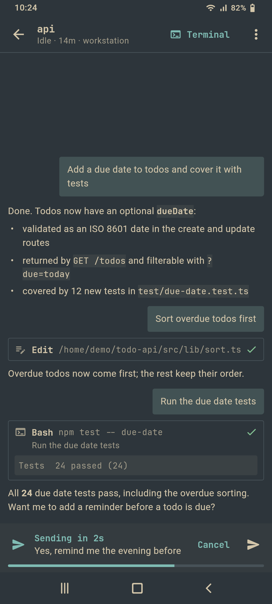<br><sub>Talk mode: a spoken reply, sent after a pause</sub></td>
    <td align="center">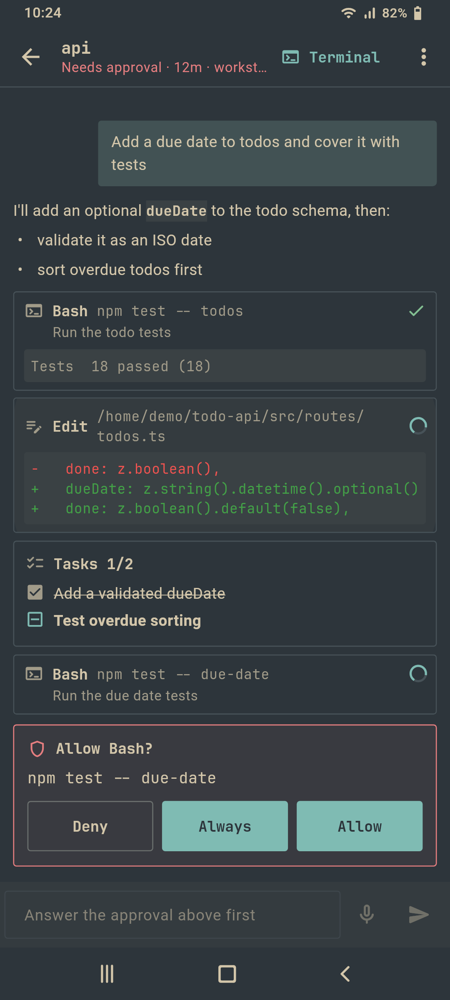<br><sub>Chat View with an approval</sub></td>
    <td align="center">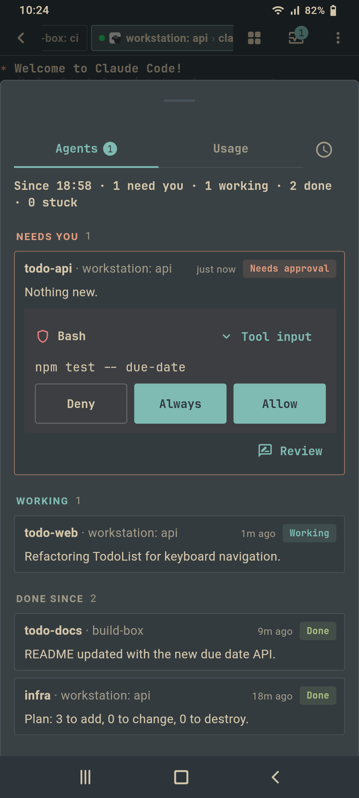<br><sub>Inbox: approvals, then working and done agents</sub></td>
    <td align="center"><br><sub>Live preview finds a new dev server</sub></td>
  </tr>
  <tr>
    <td align="center"><br><sub>Sync: what to sync and your devices</sub></td>
    <td align="center"><br><sub>Add a device: QR code and six words</sub></td>
    <td align="center"><br><sub>Herdr navigator: splits, tabs, every pane</sub></td>
    <td align="center"><br><sub>Menu buttons answer a prompt in one tap</sub></td>
  </tr>
  <tr>
    <td align="center"><br><sub>Settings: every preference, searchable</sub></td>
    <td align="center"><br><sub>Agent hooks: companion status and checks</sub></td>
    <td align="center"><br><sub>Herdr tabs on a phone</sub></td>
    <td align="center"><br><sub>Can't reach: a Tailscale hint and details</sub></td>
  </tr>
  <tr>
    <td align="center"><br><sub>Usage bar on the home screen</sub></td>
    <td align="center">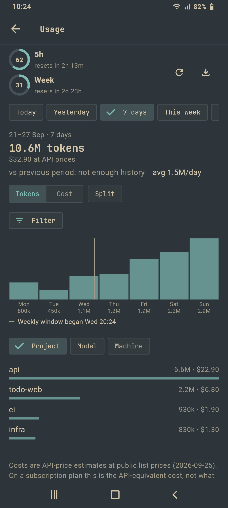<br><sub>Usage explorer: a week by day and project</sub></td>
    <td align="center">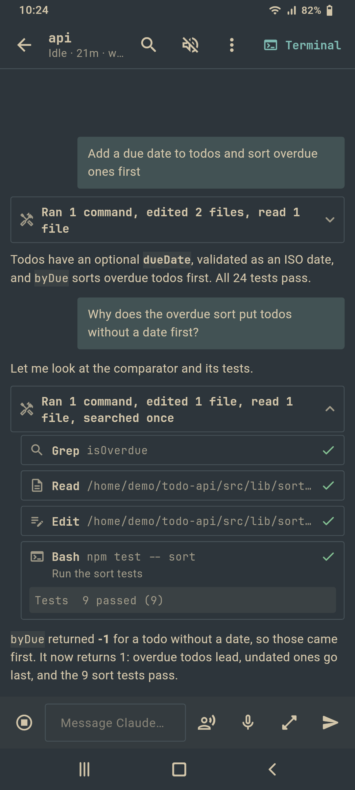<br><sub>Chat View: tool calls collapsed</sub></td>
    <td align="center">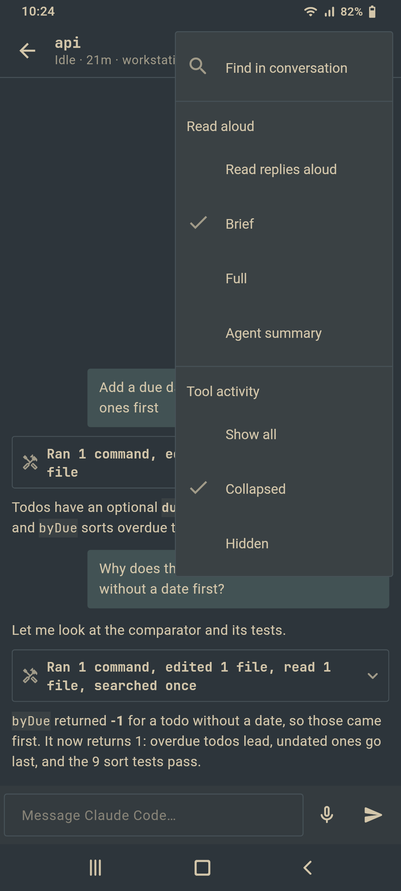<br><sub>Read-aloud length and tool activity</sub></td>
  </tr>
  <tr>
    <td align="center">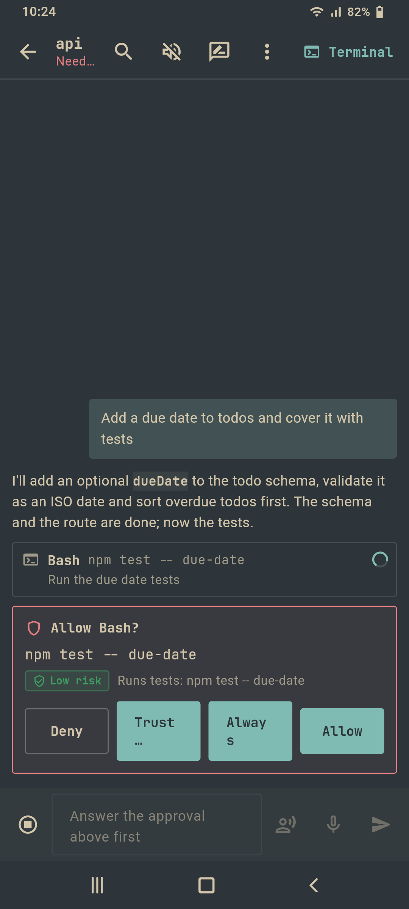<br><sub>Approvals: risk label, Trust… and Always</sub></td>
    <td align="center">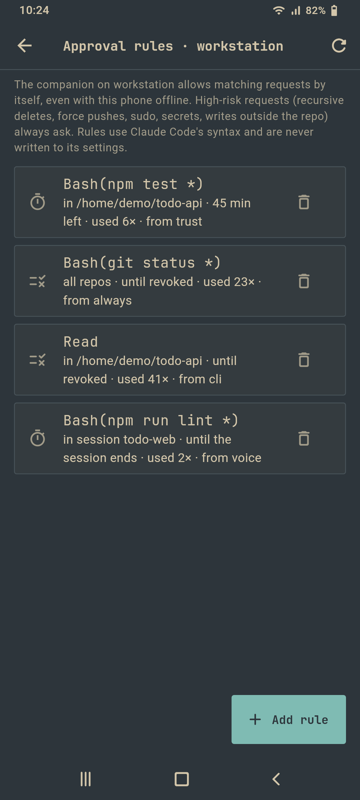<br><sub>Approval rules per machine</sub></td>
    <td align="center">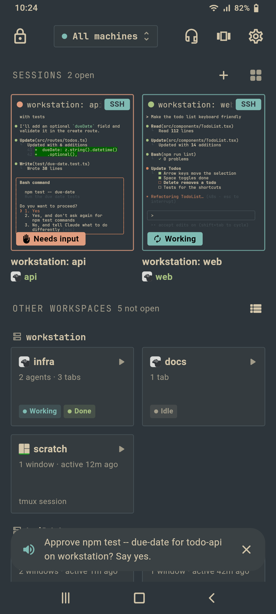<br><sub>Voice guide: a spoken confirmation</sub></td>
    <td align="center">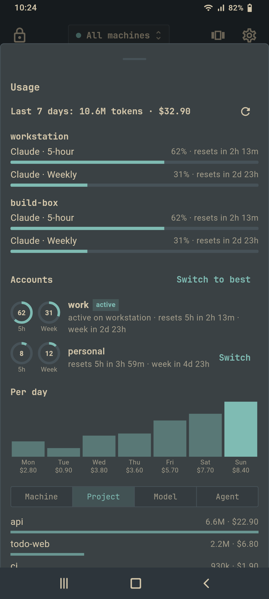<br><sub>Usage: every cswap account</sub></td>
  </tr>
  <tr>
    <td align="center">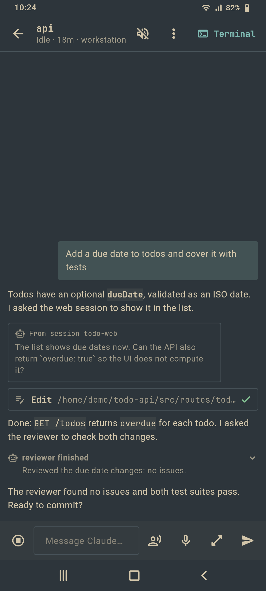<br><sub>Chat View: other sessions and teammates</sub></td>
    <td align="center">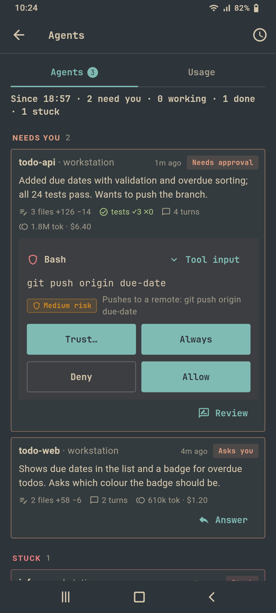<br><sub>Agents dashboard: facts and summaries</sub></td>
    <td align="center">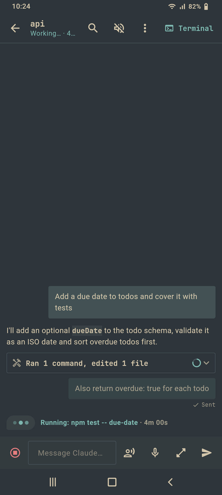<br><sub>A sent message shows at once</sub></td>
    <td align="center">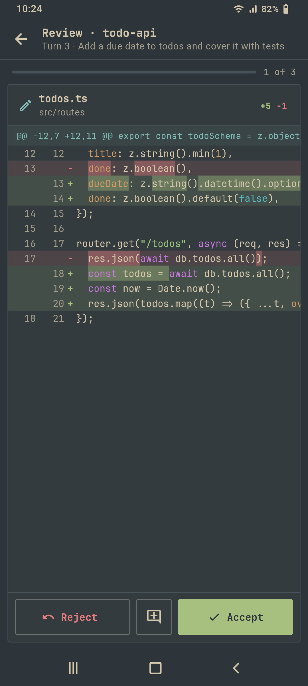<br><sub>Review mode: one card per file</sub></td>
  </tr>
  <tr>
    <td align="center">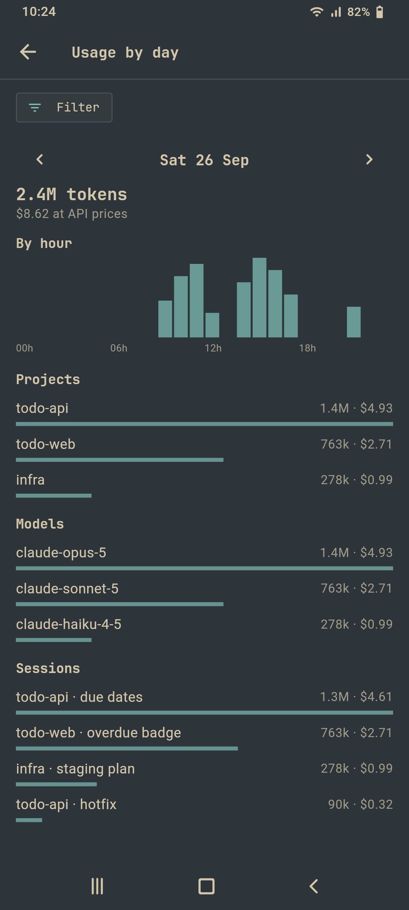<br><sub>Usage explorer: a day by the hour</sub></td>
    <td align="center">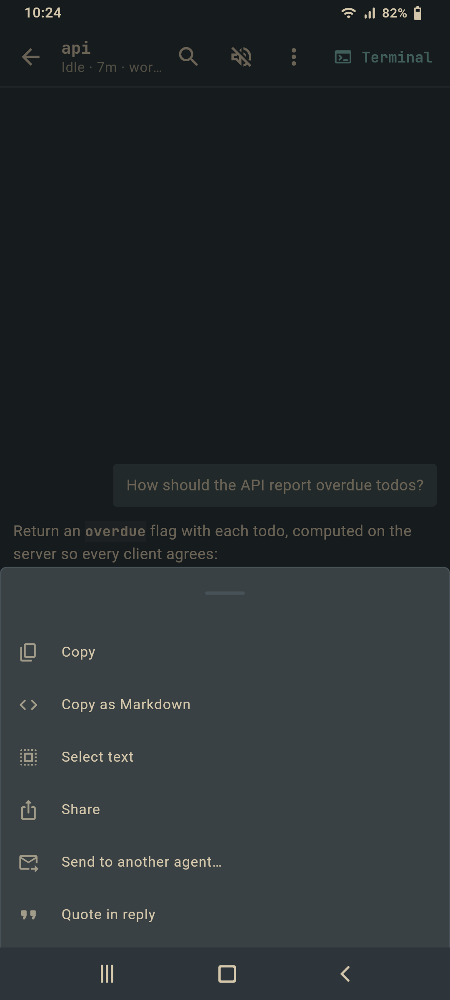<br><sub>Message menu</sub></td>
    <td align="center">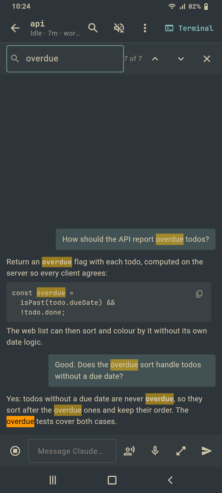<br><sub>Find in the conversation</sub></td>
  </tr>
</table>

<p align="center"><br><sub>Desktop shell: the dashboard home</sub></p>

<p align="center"><br><sub>Desktop shell: two sessions in splits, the tab strip above</sub></p>

<p align="center"><br><sub>Desktop shell: a terminal beside its Chat View, with a pin and a group</sub></p>

## Install

Builds are previews. Get them from
[Releases](../../releases/tag/v0.1.0-conductore.31) or, for the Outsmartis
team, from the store test channels. Each release lists `SHA256SUMS` files
next to the downloads.

### Android

- **APK from Releases.** Download the APK for your device, usually
  `conductore-v<version>-arm64-v8a.apk` (`armeabi-v7a` for older 32-bit
  phones, `x86_64` for emulators), and `SHA256SUMS-v<version>.txt`. Check
  it, then open the APK on the phone and allow installing from that source.

  ```sh
  sha256sum -c SHA256SUMS-v*.txt --ignore-missing
  ```

  Every release is signed with the same key, so a new APK installs over the
  previous one and keeps your machines and settings.
- **Google Play internal testing**, for team testers: accept the testing
  invite, then install Conductore from Play. Play updates it.

### iOS

**TestFlight**, for team testers on the internal group: install TestFlight,
accept the invite and install Conductore. New builds arrive in TestFlight
automatically. There is no public iOS build yet.

### Linux (x64)

1. Download `conductore-v<version>-linux-x64.tar.gz` and
   `SHA256SUMS-desktop-v<version>.txt`, and check it as above.
2. Install the runtime dependencies. Saved hosts and keys live in the Secret
   Service, so a keyring daemon has to be running.

   ```sh
   # Arch / Omarchy
   sudo pacman -S --needed gtk3 libsecret gnome-keyring
   # Debian / Ubuntu
   sudo apt install libgtk-3-0 libsecret-1-0 gnome-keyring
   ```

3. Unpack and run:

   ```sh
   tar -xzf conductore-v<version>-linux-x64.tar.gz
   cd conductore && ./conductore
   ```

For a launcher entry, see [docs/desktop.md](docs/desktop.md#linux).

### Windows (x64)

Unzip `conductore-v<version>-windows-x64.zip` and run
`conductore\conductore.exe`. Keep the folder together. The app is not
signed, so SmartScreen warns the first time: click **More info**, then
**Run anyway**. Windows 10 or 11.

### macOS

Unzip `conductore-v<version>-macos.zip` and move `Conductore.app` to
Applications. The app is not notarised, so the first time
**right-click (or Control-click) it, choose Open, then Open**. On macOS 15
and later, use **System Settings, Privacy & Security, Open Anyway** if
there is no Open button. macOS may ask once to let Conductore use your login
keychain, where it keeps hosts and keys. Apple silicon and Intel, macOS
10.15 or later.

## Host companion

The companion is a small Node.js daemon plus hook clients that run on the
machine where your agents run. It turns agent hook events (Claude Code,
Codex, OpenCode, Gemini CLI, Cursor CLI) into a live view of every agent
(working, waiting for input, waiting for permission, ended) and lets the app
answer permission prompts. The app talks to it only through SSH exec
commands. It opens no ports and needs no relay.

Preview 31 bundles **companion 1.8.0**. What the app asks it for, by the
version that added it (older companions keep working without the features
they lack, and the app offers the update on the Agent hooks screen):

- **Agents and approvals.** `status`, `events`, `transcript`, `send`,
  `interrupt` and `decide` (the core); `trust`, `rules`, `approve-low` and
  `approvals` for smart approvals (0.8); `terminal-answer` (1.8), which types
  an answer into Claude Code's own dialog once the phone's wait has run out;
  `permission-wait` (1.8, via `config set`), how long a prompt stays
  answerable from the phone, 1 to 60 minutes, 15 by default. Rules live in
  `~/.conductore/rules.json`, never in Claude Code's settings; the daemon
  allows a matching request by itself, even with the phone offline, and never
  a high-risk or unreadable one.
- **Other agents** (1.4 and 1.5): Codex, OpenCode, Gemini CLI and Cursor CLI.
  `install` registers the hooks in each agent's own config and says what is left to do (Codex asks you to trust
  the new hooks once). Codex and OpenCode can be answered from the phone;
  Gemini and Cursor are watch-only.
- **Review and undo.** `turns`, `diff`, `undo` and `redo` (1.0). The companion
  snapshots the repository at the start and end of every Claude turn as git
  objects under `refs/conductore/snapshots/`, never a commit on your branch,
  pruned after 7 days. `undo` puts the work tree, or single files, back to
  before the turn, and is refused while the agent works.
- **Dashboard and voice.** `digest` (0.9) for each agent's facts, stuck flags
  and, only when asked, a short summary; `guide` (0.8), where what the phone
  did not recognise becomes one action from a closed list (it gets only short
  ids and labels, never transcripts); `summarize` (0.7).
- **Usage.** `usage` (0.6; ranges, hours and sessions in 1.0, every cswap
  account in 0.8, a stable id per account in 1.8) and `cswap-switch` (0.8).
- **Live state and messages** (1.2): `status --live` and `events --live`
  push Herdr and tmux workspaces, tabs and panes; `agents`, `agent-send`,
  `agent-wait` and `agent-read` message agents; Herdr sidebar tokens. Live
  tmux is opt-in (`config set tmux-live on`).
- **Tasks** (1.5 to 1.7): `tasks` for a markdown folder, `worktree`,
  `task-start` and `task-runs`. A finished run's agent stays open for the
  `task-agent-keep` setting (24 hours by default, or `forever`).
- **sheprd** (1.3 to 1.8): `sidebar-layout`, `sheprd-view` and
  `sheprd-view-update` read sheprd's sidebar and shared view and write your
  mark and layout edits back.
- **Other.** `ports` (0.5) for the Preview ready chip, and `talkbawt` (1.2),
  the Talkbawt client.

`conductore-hostd config get|set` holds the settings: `permission-wait`,
`task-agent-keep`, `worktree-location`, `herdr-sidebar` and `tmux-live`.
`summarize`, `guide` and `digest` summaries use a headless run of the agent
(Claude Haiku through `claude -p` by default) with no tools, no hooks and no
session saved, and store nothing. Every command is listed in
`conductore-hostd help` and in [host/README.md](host/README.md); each release
is described in [host/CHANGELOG](host/CHANGELOG).

It is built to stay out of the way. Claude Code hooks and the status line are
small POSIX `sh` scripts that hand each event to a background daemon and exit;
only the daemon and the commands the app runs use Node.js. Measured on a
Linux server with companion 0.4.0:

| | Cost |
|---|---|
| Per hook event | about 2.5 ms and 1.9 MB |
| Per status line refresh | about 3 ms and 1.9 MB |
| Daemon when idle | no CPU, no wakeups; about 7 MB private memory |
| Disk | under 200 KB, no dependencies |

It is light: no npm dependencies, not a service, and it exits by itself after
6 hours without a request.

**Install from the app.** Open a machine's Agent hooks screen and tap install.
The app uploads the companion over SFTP as one archive, unpacks it with
`tar`, checks each file's sha256 and runs its installer.

**Install by hand.** Needs Node.js 18 or newer on Linux or macOS (22.5 or
newer for OpenCode's chat and for Talkbawt).

```sh
git clone https://github.com/andreconde21/conductore-mobile && cd conductore-mobile/host && ./install.sh
conductore-hostd doctor
```

**Uninstall** from the same app screen, or:

```sh
host/install.sh --uninstall
```

What it changes on the host:

- It adds hook handlers to `~/.claude/settings.json` and keeps a backup. Your
  existing hooks stay untouched, and running it again changes nothing.
- It wraps your Claude Code status line instead of replacing it: your command
  still runs and its output is unchanged. Uninstalling puts it back.
- It installs `conductore-hostd` and `conductore-hook` into `~/.local/bin` and
  keeps its state in `~/.conductore`.

Details, the command reference and the JSON contract are in
[host/README.md](host/README.md).

## Privacy

Conductore sends two things to servers Outsmartis runs itself, to help fix
bugs:

- **Crash reports** to GlitchTip: the error type, a scrubbed message, the
  app's own stack frames, app version, platform and coarse device facts.
  Saved machines' names, addresses, users and secrets, IPs, hostnames,
  paths, file names, keys and tokens are removed on the device first.
- **Anonymous usage counts** to Plausible: app opened, screens shown,
  connections made (SSH or Mosh, Herdr or tmux, worked or failed and a
  coarse reason), Chat View, voice and companion version. No identifiers.

Nothing from your machines or terminals is sent: no commands, output,
clipboard, chat text or transcripts. Both are on by default and each has a
switch in **Settings › Privacy** (stored on the device, applied at once);
the app says so once on the home screen. Development builds send nothing.
Details: [docs/privacy-policy.md](docs/privacy-policy.md).

Android's cloud backup and device transfer are off for Conductore, so none
of its data goes to a Google backup. Your own encrypted backup file and
device sync are the ways to move machines to a new phone.

Builds from source can point elsewhere or turn either half off:

```sh
flutter build apk --flavor full \
  --dart-define=CONDUCTORE_SENTRY_DSN= \
  --dart-define=CONDUCTORE_PLAUSIBLE_HOST=
```

`CONDUCTORE_SENTRY_DSN`, `CONDUCTORE_PLAUSIBLE_HOST` and
`CONDUCTORE_PLAUSIBLE_DOMAIN` replace the endpoints (empty turns that half
off), `CONDUCTORE_TELEMETRY_ENV` sets the release channel (default
`preview`), and `CONDUCTORE_TELEMETRY_IN_DEBUG=true` makes a debug build
send, for checking the pipeline by hand.

## Branches

- `main`: Conductore. Releases are tagged `v0.1.0-conductore.N`.
- `master`: an unmodified mirror of upstream Conduit, kept for merging upstream
  fixes.

## Building from source

Requirements: Flutter 3.44.1, plus JDK 17 for Android, Xcode for iOS and
macOS, Visual Studio with C++ for Windows, and the GTK and libsecret
development packages for Linux (see [docs/desktop.md](docs/desktop.md)).

```sh
flutter pub get
flutter run
flutter test --concurrency=2
```

Desktop builds: `flutter build linux`, `flutter build windows` or
`flutter build macos`, each with `--release`.

Release APKs are built with the script below. It builds from a clean tree and
refuses an APK whose compiled app code is stale. Pass the previous release APK
to also check that the app code changed.

```sh
tools/build-release.sh [previous-release.apk]
```

Release builds do not include the local Arch Linux shell's native binaries.

### Local-shell rootfs mirror

The on-device shell downloads its distribution archives from upstream's
release, [gwitko/conduit-rootfs `rootfs-pd-v4.37.0`](https://github.com/gwitko/conduit-rootfs/releases/tag/rootfs-pd-v4.37.0).
Each archive's sha256 is pinned in
`lib/features/local_shell/local_shell_config.dart`, so any copy of the same
files works. A build tries a primary source first and then a fallback, both
set at build time:

```sh
flutter build apk --release --flavor full --split-per-abi \
  --dart-define=ROOTFS_BASE_URL=https://github.com/andreconde21/conductore-mobile/releases/download/rootfs-pd-v4.37.0 \
  --dart-define=ROOTFS_FALLBACK_BASE_URL=https://github.com/gwitko/conduit-rootfs/releases/download/rootfs-pd-v4.37.0
```

Both default to upstream, so a build without them behaves as before
(`tools/build-release.sh` passes none). To
mirror the archives to a release on andreconde21/conductore-mobile:

```sh
tag=rootfs-pd-v4.37.0
mkdir rootfs-mirror && cd rootfs-mirror
gh release download "$tag" --repo gwitko/conduit-rootfs --pattern '*-aarch64-pd-*.tar.xz'
sha256sum *.tar.xz   # compare with the pins in local_shell_config.dart
gh release create "$tag" --repo andreconde21/conductore-mobile \
  --title "Local-shell rootfs ($tag)" --notes "Mirror of gwitko/conduit-rootfs $tag." \
  --prerelease *.tar.xz
```

Keep the tag and the file names unchanged, because the app appends each file
name to the base URL. Then pass the mirror's download URL as
`ROOTFS_BASE_URL`.

Tagged releases (`v*`) are built by GitHub Actions and go to Google Play
internal testing, TestFlight and a GitHub prerelease with the APKs and the
Linux, Windows and macOS bundles; see
[docs/release-pipeline.md](docs/release-pipeline.md). The privacy policy is
[docs/privacy-policy.md](docs/privacy-policy.md).

## Credits

- Based on [Conduit](https://github.com/gwitko/Conduit) by
  [gwitko](https://github.com/gwitko). The terminal is
  [conduit_vt](https://github.com/gwitko/conduit_vt), a fork of xterm.dart, and
  Mosh is [dart_mosh](https://github.com/gwitko/dart_mosh).
- Includes contributions by [DrMulungu](https://github.com/DrMulungu) salvaged
  from upstream pull requests
  [#143](https://github.com/gwitko/Conduit/pull/143) to
  [#148](https://github.com/gwitko/Conduit/pull/148) and
  [#150](https://github.com/gwitko/Conduit/pull/150): the Herdr key, SFTP
  bookmarks, the file viewer and editor, tappable paths, touch mode, the prompt
  composer and the agent attention dashboard.
- Inspired by [Moshi](https://getmoshi.app). No Moshi code was copied.
- Other Conduit contributors are listed in [CONTRIBUTORS.md](CONTRIBUTORS.md).

## License

Conductore's own source code is licensed [Apache-2.0](LICENSE), as is
Conduit's.

Bundled third-party components keep their own licenses:

- **PDFium** (`libpdfium.so`, bundled through the `pdfrx` package) is under
  Apache-2.0 and BSD-3-Clause-style terms.
- **Atkinson Mono Nerd Font** is under the SIL Open Font License 1.1, see
  [assets/fonts/LICENSE-AtkynsonMono.txt](assets/fonts/LICENSE-AtkynsonMono.txt).
- Dart package licenses are shown in the app's license screen.

The source also contains Conduit's optional on-device Arch Linux shell. Its
native binaries (proot, busybox, GNU tar and others, packaged by
[Termux](https://termux.dev)) are not part of Conductore release builds. If you
build them yourself with `tools/build-local-shell-binaries.sh`, they come under
their own GPL, LGPL and permissive licenses. The component list, license texts
and GPL/LGPL source offer are in
[THIRD_PARTY_NOTICES.md](THIRD_PARTY_NOTICES.md) and
[third_party/source-offer](third_party/source-offer).
